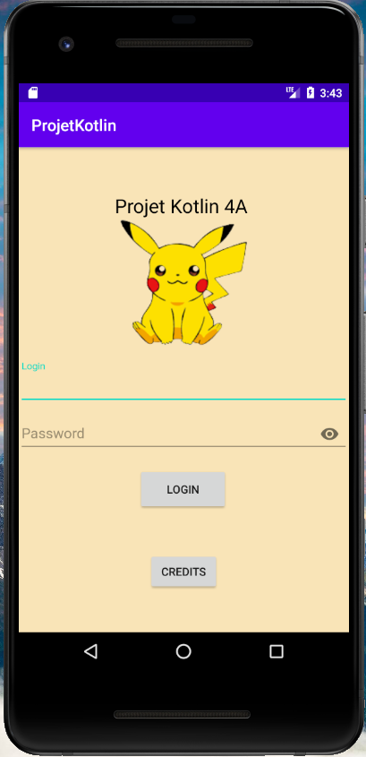
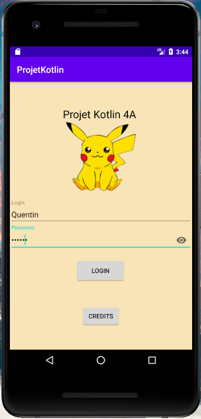
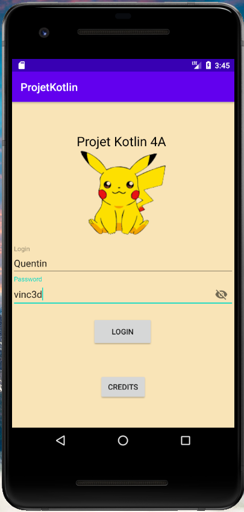
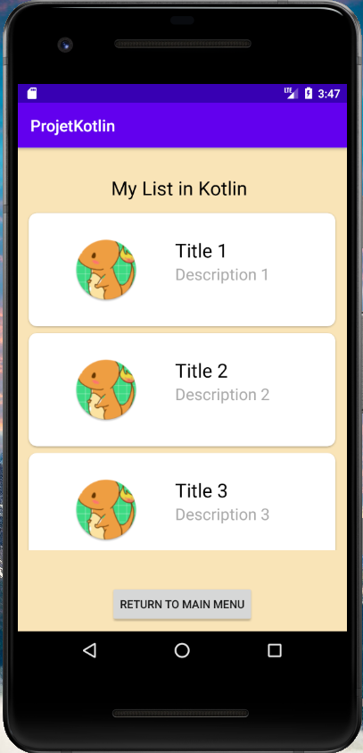
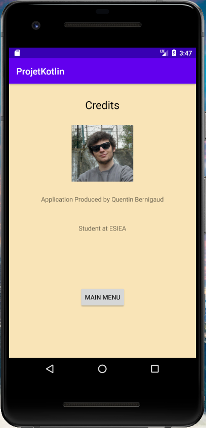

## 4A-Prog-Mobile-Projet

Création d'une application mobile affichant une liste d'éléments ainsi que leur détails en utilisant **KOTLIN**

## Installation

* Avoir [Android Studio](https://developer.android.com/studio) d'installé.
* Récupérer la branche Master de ce projet.  
```
https://github.com/QuentinBernigaud/ProjetKotlin
```

## Notation

### Notions abordées 

* **MVVM**
* **Clean Architecture**
* **ViewModel**
* **ROOM** (BDD)
* **Recycler View** :
  - Affichage d'une liste
  - Design de la liste
* Login Page

## Screenshot 

Écran de démarage de l'application
---



mot de passe caché 
---



mot de passe affiché une fois cliqué sur l'oeil
---



Écran où j'affiche ma liste via une RecyclerView
---



Écran des crédits, basique
---



## Améliorations

* Comprendre pourquoi sur ma liste, l'image affichée possède le background vert de base
* Inclure un appel Api sur la liste API créée pour l'occasion
* Écran de création de compte
* Base de donnée pour rendre utile l'écran de login
* Activity supplémentaire lorsque l'on clique sur un élément de la recylcer view
* Design des acitivty en elle-même
* Un lien cliquable dans l'écran crédits vers le site de l'ESIEA


## Auteur

* **Bernigaud Quentin** Étudiant à l'[ESIEA](https://www.esiea.fr) 
* Projet effectué en 4ème année.

## API

[API](https://github.com/QuentinBernigaud/ProjetKotlin/blob/features/PokemonList.json)
